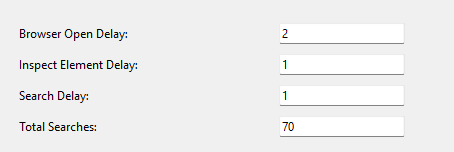

# Status 
🟢 Working

# Microsoft-Rewards-Automation
A program to automate web searches for quick Microsoft Rewards completion. (Both PC and ~Mobile~)
It is also able to simulate human typing.

# Instructions

1. Install Python if not already installed. Not tech-savvy? Use Reward Automation_legacy.zip (older version).
2. Clone this repository:
   - Go to the code section and click "Download ZIP."
3. Open the folder in an IDE.
4. In the IDE terminal, run `pip install -r requirements.txt`.
5. Navigate to src/App.py and execute it.

# Note
Before starting, make sure the delays correspond to the time it takes to perform specific actions on your PC.    
    

⚠️ Don't use the PC while the program is running.   
⚠️ You can stop the program by changing the active window.  
⚠️ This code is provided for educational purposes only.  
It serves as a demonstration of automating repetitive tasks using Python and tkinter.  
Please use this code responsibly and in accordance with applicable laws and guidelines.  
The author and contributors are not responsible for any misuse of this code.  
Feel free to modify and distribute it while adhering to the license terms.    

You can see the releases from here: https://github.com/StDensity/Microsoft-Rewards-Automation/releases

# Thank you <3

Any improvements or bugs, let me know.  
If you are new and don't know how to use it. let me know.    
Good Day :)

